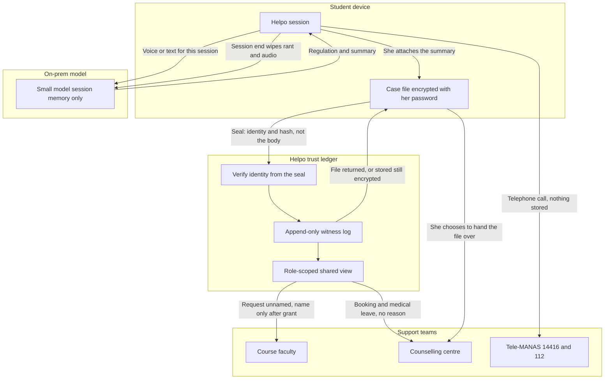
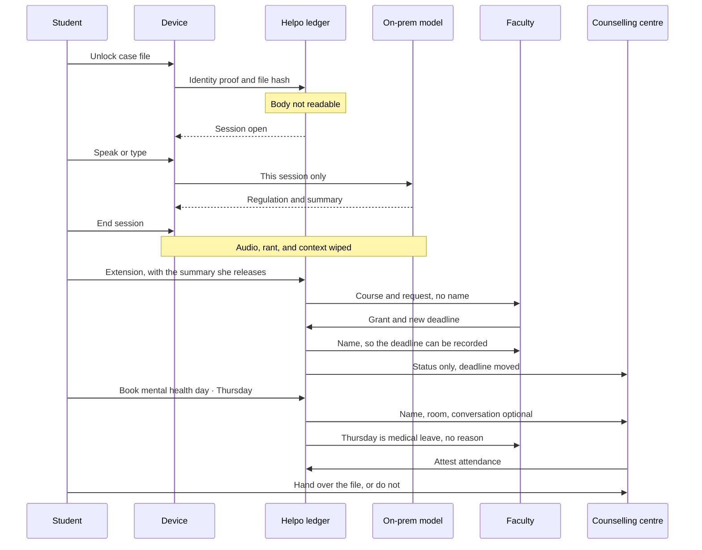

# Helpo — design

A web app for G. Narayanamma Institute of Technology and Science (GNITS), Shaikpet. Students use it in the week they are in. Faculty and the counselling centre meet them there, with less of the bias and the performance that usually sits in the middle.

This document is the build plan. It locks product behavior, screens, and what is real in this version.

## Decisions

| Choice | What we are building |
| --- | --- |
| Shape | The product opens first. A short Why Helpo note sits beside it for the pitch. It is not a marketing site with a demo buried underneath. |
| Roles | Student, faculty, counsellor. A preview switch moves between them so the anonymous grant, the identity reveal, and the attendance mark all happen on one screen. |
| Crashout | A live model with a hard boundary: settle the body, write a professional summary, never advise on the situation. Text and voice. |
| Campus | GNITS. Real room, real attendance rule, real helplines. People in the demo are sample accounts. |
| Surface | A proper web app. A phone app is later. |

## The category

Joined-up case management means the people around one student act from one case, not from three separate conversations that never meet. Faculty own the deadline. The counselling centre owns the room and the attendance mark. A national helpline owns clinical care. The student is the only person in all of those rooms.

Most systems join the teams by copying her story into a shared file. That is how bias and hesitation get built in. She will not write the email if the person who grades her also holds the rant. She will not book the room if booking means an intake form.

Helpo joins the teams around the **actions**, and leaves the **story** with her.

- One case.
- A shared operational view: what was asked, what was granted, which day is medical leave, whether a file has been handed to a person.
- A private case file only she can open, until she chooses to hand it to someone.
- Helpo itself is the witness in the middle. It checks who she is, appends what happened, and cannot read the file it is witnessing.

The impact is the completed loop. A deadline moves. A day is marked medical leave under the rule GNITS already has. A chair exists in the counselling centre without a forced conversation. A real helpline is one tap away. The next person she trusts can receive the summary so she does not have to start the story again. The rant is not in the faculty inbox and not in the college database.

## The product in one pass

Four doors, inside a session, with a sealed case file the student owns.

1. **Extension.** Anonymous note to the faculty who owns the deadline. Up to 3 a semester. The name stays sealed until the faculty grants it, because only then do they need it to actually move the date.
2. **Mental health day.** Up to 3 a semester. Take a mental health day — no questions asked. Attendance is marked as medical leave. The student does not have to speak to the counsellor. Interviews, exams, and other dates that cannot move are blocked on the timetable.
3. **Professional help.** Tele-MANAS and the campus centre, as phone calls to people. Not another chat.
4. **Crashout.** Text or voice, including a native language. The model helps the student slow down and hands them a summary fit to paste into an extension note or keep in the case file. It does not tell them what to do about the situation.

A first-run tutorial walks the four doors. It can be replayed from the side rail.

## One student, one night: Ananya Rao

Sample student, built to be walked in the pitch. CSE, II year, GNITS. Not a real person. The week around her is shaped like a real GNITS week.

**Where she is on Wednesday night.** Operating Systems assignment is due Thursday, 11:59pm. She has not started. Something at home has taken the last four days. Her attendance in the course is 76%. An unmarked absence drops her under the 75% line and toward condonation. Friday is a placement pre-assessment, which cannot move. Monday is a mid-term, which cannot move. She can imagine the email to her faculty and she will not send it. She can imagine explaining herself at the counselling centre and she will not walk in. She opens Helpo instead.

The pitch follows her. At each step the room sees her screen, then the faculty screen, then the counselling screen. The point of the cuts is the shared view: each team’s screen updates because she acted, and none of them received the rant.

### 1. She opens a session, and the file stays shut

She unlocks the case file on her own machine. Helpo receives proof that she is Ananya Rao, II CSE, and a hash of the file. It does not receive the file. The session opens. The witness line reads: identity checked, body unread.

She can see her allowances: extensions 3 of 3, mental health days 3 of 3. The tutorial offers itself once, then gets out of the way.

### 2. She says it out loud

She does not type. She holds the mic and talks, Telugu mixed with English, angry, not in any shape to write to a professor. Helpo was not listening before she pressed. She stops. The transcript comes back in the words she said. She fixes one wrong word.

What comes back is short regulation in the language she was speaking, and a summary in English:

> I am in II CSE. I am asking for the Operating Systems assignment, due Thursday, to move to Monday. A situation at home has taken the last four days. I can submit on Monday. I am not asking to move the mid-term.

She deletes a sentence she does not want sent. She attaches the summary to her case file. She ends the session. The audio, the transcript, and the model’s context are gone. The summary remains only because she attached it. The witness log records that a crashout session closed. It does not record what she said. Faculty and the counselling centre see nothing from this step.

### 3. She asks for the deadline, still unnamed

A new session. The file is presented sealed again. She opens Extension, chooses Operating Systems, and asks to move Thursday to Monday. She releases the summary into that request. The rant is not in the release. She is told, in one line, that the faculty will see the course and the request, and will see her name only if they grant it.

**Faculty inbox, same moment.** A row: CSE · Operating Systems · assignment · Thursday to Monday · 11:42pm. No name, no roll number, no photo. The letter is the summary she edited. There is no earlier case, because the faculty view has no door into one.

### 4. The grant is what reveals her

Thursday morning the faculty reads the letter and grants Monday, 11:59pm. The name appears then: Ananya Rao, and the roll number, because the deadline cannot be written against a blank. The reason is on the screen. If they had declined, the name would have stayed sealed.

**What updates for everyone else.** Ananya sees the new deadline and that her name is now known to that faculty, for that request. The counselling centre’s shared view gains one status line: OS deadline moved to Monday. They do not gain the letter. The witness log appends the grant. Her allowance is 2 of 3.

### 5. She takes Thursday in the room, without a conversation

The assignment can wait until Monday. She still cannot sit in class today. She opens Mental health day. Friday is marked blocked: placement pre-assessment. Monday is marked blocked: mid-term. Thursday is open. She books a mental health day. The screen says talking to someone is her choice. No reason is asked.

**Counselling board.** Ananya Rao · Thursday · the counselling centre · conversation optional · attestation pending. The centre needs her name to hold the chair and to mark attendance. It does not need the home situation, and it does not get it.

**Faculty view of the same fact.** Thursday is medical leave. They mark her present under that head. They do not see why. Her absence stops being an unmarked hole under the 75% rule. The College Academic Committee still condones shortage through its own process. Helpo gives her the attested record that process already asks for.

### 6. She can hand the story to a person, or not

She sits the day. She does not have to speak. If she wants to, she hands the case file to the counselling centre. What opens for them is the summary she attached, not the audio and not a hidden journal. If she does not hand it over, their screen stays the booking and the status line.

If she wants someone whose whole job is this, Help is Tele-MANAS at 14416, and 112 if she is in immediate danger. That call is not written onto the shared view. Seeking a helpline is not an event the college needs to witness.

### Where she is on Thursday evening

The assignment is due Monday. Thursday is medical leave. A chair was hers without an explanation. The faculty knows her name only because they granted the time. The centre knows she was in the building, not what she said into the mic. She still has 2 extensions and 2 mental health days. The rant exists nowhere in the system.

That is the case. Joined, because each team’s next action was on their screen when it became their job. Private, because the story never became the shared file.

## The shared view

At the end of Ananya’s Thursday, one case, four different screens. This is the view the demo must be able to show by switching **Preview as**.

| Fact | Ananya | Course faculty | Counselling centre | Helpo witness log |
| --- | --- | --- | --- | --- |
| Telugu rant and audio | Gone after the session | No | No | No |
| Summary she edited | In her case file | Inside the extension she sent | Only if she hands the file over | No |
| OS request, Thursday to Monday | Yes | Yes, unnamed until grant | No | Event appended |
| Name and roll number | Hers | Released by the grant | On the room booking, because the room and the register need it | Not a piece of content |
| Monday deadline | Yes | Yes, so they can record it | Status only: deadline moved | Event appended |
| Thursday, the counselling centre | Booked, conversation optional | No | Yes | Event appended |
| Attendance | Medical leave | Medical leave, no reason | Attested | Event appended |
| Call to Tele-MANAS | Her choice | No | No | No |

Two layers, on purpose.

**Witness log.** Helpo’s append-only record that a session opened, identity was checked, the body was unread, and an action was committed. Write-only. No edit, no delete. A correction is a new line. This log is how the system can be audited without becoming a diary.

**Shared case view.** The operational fields each team needs in order to act. Derived from actions she took that involve that team. Faculty never see crashout. The centre never sees the letter unless she releases the file. Nobody sees a helpline call.

Anonymity is not applied everywhere, because the jobs differ. The grader’s bias is the reason the extension hides her name until grant. The attendance register cannot mark a blank name, so the counselling view has her name and still has no reason. Joined-up here means each team receives the slice that lets them do their job, at the moment it becomes their job.

## Architecture

Helpo sits between the student and the teams as a trust ledger. It is not the owner of the case.



A session is a fixed protocol. The same protocol wraps a crashout, an extension, and a booking.



**Encryption.** The case file is encrypted on her device with a password only she knows. Helpo can store the ciphertext if she asks it to keep a copy. Helpo cannot decrypt it. At the end of a session the file is returned to her. Hand-over decrypts for the person she names, on her confirmation, and that release is itself a ledger line.

**Write-only witness.** The ledger appends. Staff interfaces have no update and no delete on those lines. Helpo never receives a decrypted prior history in order to append a new event.

**Model.** A small model on premises. It sees the current session’s text or transcript. It returns regulation and a summary. When the session ends, that memory is wiped. It is not a participant in the case. It cannot see the ledger, the faculty inbox, or an unreleased file. The summary enters the case only if she attaches it, and enters a team’s view only if she releases it.

**Hotline.** A `tel:` link to a person. No transcript, no log line on the shared view.

**What each boundary stops.** Faculty cannot browse who has used crashout. The centre cannot read an extension they were not given. Helpo cannot mine case files, because it holds ciphertext and hashes. The model cannot accumulate a profile across semesters, because it has no store. A declined extension cannot leak a name.

## What this version is honest about

The trust story has two layers. The screen tells them apart.

**Intended system, shown as a ledger the user can read.** Helpo is a witness. When a session starts, the student presents a sealed case file. Helpo checks that it is theirs and cannot read it. Helpo appends what happened in the session (an extension was asked, a day was booked, a summary was attached) with write-only access. At the end, the file goes back to the student. They may leave it encrypted in Helpo’s store under a password only they know, or take it with them. If they later choose a person, they hand that person the file. Faculty never receive past case detail. They receive the current request, and a name only after they grant.

**This build.** The ledger is a real append-only log in the app, and other roles genuinely cannot open the case body. Files are not yet encrypted with a user password, and the model does not yet run on a machine in the college. Copy on the seal says: Helpo keeps the event, not the story. It does not say the file is encrypted on campus servers, or that the model runs on premises, until both are true.

Cloud speech and the live model process a request in order to answer it. Our server does not store the audio, the rant, or the summary after the response is sent. Ending the session clears them from the browser. The Why note can say the destination is a small on-prem model whose memory ends with the session.

## Principles that constrain the interface

- The student is a person with a deadline, not a case to be managed on screen.
- Caps are visible and plain. 3 extensions, 3 mental health days. No streak, no guilt, no “you still have credits, use them.”
- Professional care is a phone number and a room. The model is not a counsellor and is not styled as one.
- AI is in one place, for one job: the student cannot write the letter yet. The model writes the letter and helps them settle. It is absent from extensions, the day booking, and the hotline.
- Demo data looks like a GNITS week. Departments, a timetable, the counselling centre, the 75% attendance rule. Sample names are obviously sample names.

## Campus facts the product uses

Taken from GNITS’s own pages and academic regulations. Used as the world of the app, not as a claim that the college has already adopted Helpo.

- Student Counselling Centre on campus. Helpo is a proposed door to take a mental health day, not a replacement for counsellors on staff.
- End-semester eligibility needs **75% attendance**. The College Academic Committee can condone a shortage of up to **10%** (down to 65%) on genuine grounds, including medical, against a representation and evidence. A mental health day in Helpo produces an attested medical-leave record for that process. The app does not silently rewrite the regulation or promise the committee will condone.
- National line: **Tele-MANAS, 14416** (also 1800-891-4416). Free, 24×7, many Indian languages. If someone is in immediate physical danger, **112**.

Sample accounts (not real students or staff):

| Role | Who | Used for |
| --- | --- | --- |
| Student | Ananya Rao, CSE, II year | The main walkthrough |
| Student | A second student | So the faculty inbox is not a single card |
| Faculty | Course faculty for OS and for a lab | Extension inbox and the reveal |
| Counsellor | Counselling centre desk | The day’s board at the counselling centre |

## Information architecture

```
Helpo
├── Preview as          Student · Faculty · Counsellor
├── Student
│   ├── Home            four doors, remaining allowances, next blocked dates
│   ├── Extension       course, faculty, what moved, anonymous thread
│   ├── Mental health day   calendar, exceptions, booking, attestation
│   ├── Help            Tele-MANAS, 112, campus room
│   ├── Crashout        text or voice → regulation → summary
│   ├── Case file       sealed record, what Helpo witnessed, hand-over
│   ├── Tutorial
│   └── Why Helpo       short pitch, off the main path
├── Faculty
│   ├── Inbox           unnamed requests
│   └── Request         read, grant or decline, then the name
└── Counsellor
    ├── Today           the counselling centre board, conversation optional
    └── Attest          mark the day as medical leave
```

The side rail is the product. The main pane is the session. Role preview sits at the top of the rail, labeled **Preview as**, so a pitch can change chairs without a fake login wall.

## Visual direction

Quiet academic software. Warm paper, not a clinic and not a wellness brand.

- Ground `#f4f0e8`. Ink `#1c1915`. A single green `#1f6b4a` for actions that commit (grant, book, copy summary). Hairline rules, no cards stacked for decoration.
- Type: a sharp grotesque for UI (Geist or equivalent), a serif only for the case-file title and the Why note. Sizes set for a laptop in a classroom and for a projector.
- Motion is short. Panels settle. Recording is the only view that feels alive: a thin level meter, nothing bouncing.
- Anonymous state is a sealed strip where the name will be. After grant, the name fades in on the faculty side and the student sees “Your faculty can see your name now.”
- Empty states are one sentence and the next action. Errors say what failed and what to do (microphone blocked, model unreachable, date blocked).

Layout, desktop:

- Left rail, 240px, fixed: wordmark, preview switch, four doors, allowances, tutorial, case file.
- Main column, max 880px, reading measure for chat and letters.
- A right-hand context sheet only when it earns its place: the sealed file on an extension, the week timetable on a mental health day, the summary on crashout.

Below 960px the rail collapses to a top bar. The phone app is out of scope; the web app still has to be usable on a laptop trackpad and readable from the back of a lab.

## Student home

One screen, no dashboard widgets.

A line with the semester and what remains: **Extensions 2 of 3 · Mental health days 3 of 3.** Then the four doors, each with a single sentence:

- Ask for time, without your name.
- Take a mental health day.
- Talk to a person whose job this is.
- Say it here first. Leave with something you can send.

The tutorial is offered once, as a quiet prompt, not a modal that covers the product. Five beats: the four doors, then the case file. Skip and replay both exist.

## Extension

**Student**

1. Pick the course and the faculty. Demo set: a small timetable of real-shaped GNITS work (assignment, record, observation, project review, presentation). Exams are not in this list. An exam is not an extension.
2. Say what needs to move, and by how much. Optional: attach the crashout summary, or write in the box. The summary arrives as editable text. Sending it does not send the rant.
3. The thread opens with the student’s side labeled only as them. They are told, in one line, that the faculty sees the course and the request, and will see the name only if they grant it.
4. Cap: the fourth request in a semester is refused before it is written, with the count and the date the count resets. No workaround in the demo.

**Faculty**

1. Inbox rows: course, the ask, how long, time received. No name, no roll number, no photo, no “student from your class” hint that collapses the set to one person. If the course has many students, the row stays anonymous. The demo uses courses large enough that this is believable.
2. Opening a request shows the letter and nothing from any earlier case.
3. **Grant** asks for the new deadline, then reveals the name on that request only, with the reason on screen: you need it to record the extension. **Decline** keeps the name sealed and sends a short note the student sees. Decline is a complete outcome, not an error.
4. The faculty view has no path into the case file.

**Ledger line, both sides can see their own copy of the event.** “Extension requested · Operating Systems · granted · name released” or “declined · name stayed sealed.” The letter body is not copied into the faculty’s history beyond the open request.

## Mental health day

**Student**

1. A week calendar. Days that cannot be booked are marked and named: mid exam, placement interview, a review marked non-reschedulable. The student sees why, not a greyed square.
2. Choosing an open day shows the counselling centre, the hours, and one sentence: you can sit the day without a session. A counsellor is in the room. Talking is the student’s choice.
3. Confirming books it. Attendance for that date is requested as medical leave. The student gets a plain confirmation: date, room, “conversation optional,” and the allowance dropping from 3 to 2.
4. The same fourth-use refusal as extensions.
5. The booking does not ask for a reason. There is no symptom form.

**Counsellor**

1. Today at the counselling centre: who has booked, the slot, and the flag **Conversation optional**. The board does not show a diagnosis, a rant, or the case file.
2. The counsellor attests the day. That writes the medical-leave mark the student can carry toward the existing condonation rule. The screen names that rule in a footnote, so the demo does not overclaim.
3. If the student later chooses **Hand over case file**, the counsellor can open what the student released. Until then the row is only the booking.

## Professional help

A single calm page.

- **Tele-MANAS · 14416.** Free, 24×7, call in your language. Button is a `tel:` link.
- **If you are in immediate danger · 112.**
- **On campus · the counselling centre.** Hours, and the mental-health-day door if they want the room without a call.

No chatbot on this page. No “tell me more so I can route you.” The crashout model, if it hears language of immediate danger, stops the letter and opens this page’s content first.

## Crashout

One session. Two ways in: a writing box, or the mic. Same destination.

### What the model is allowed to do

- Help the student slow down: breathing, feet on the floor, a glass of water, step away from the screen for a few minutes. Short. Concrete. No lecture.
- Reflect a single fact they stated, without interpreting their life.
- Produce a **summary** in clear English, in the student’s voice, suitable to paste to faculty: what the work is, what happened, what they are asking. Insults, slang, and the spiral are left out. The facts stay.
- Offer the summary as text to copy, to drop into an open extension, or to attach to the case file.
- If they ask what they should do, or who is at fault, or how to win the argument: decline that part, and point to the faculty thread, the counsellor, or Tele-MANAS.

### What the model is not allowed to do

- Advise on the situation: whether to request the extension, what excuse will work, how to talk to parents, whether to skip the exam, a diagnosis, medication, or a plan for self-harm.
- Roleplay the faculty or the counsellor.
- Keep memory for a later session. The next crashout starts empty.
- Speak or write in a cute therapeutic persona. The name on screen is Crashout. The voice, if used, is neutral and slow.

### Voice

The student can say the rant. Language is whatever they speak. Telugu, Hindi, and English are the expected ones at GNITS; the transcriber auto-detects, including other Indian languages, rather than forcing a menu before they are allowed to talk.

Flow:

1. **Not listening** until they press the mic. No wake word, no ambient capture. A line on the control says that.
2. They speak. A level meter and a timer show that the mic is live. They press again to stop. A take longer than a few minutes is gently closed and still transcribed; this is a rant, not a dictation exam.
3. **Transcribing.** Audio goes to the speech API once. The browser drops the recording after the transcript returns.
4. **What we heard.** The transcript is shown in the language spoken, and they can fix a wrong word before it is sent. This step matters more for Telugu and Hindi than for English. They can discard the take.
5. The transcript enters the same model as typed text. Typed and spoken turns can mix in one session.
6. Regulation comes back as text. **Hear this** speaks only the regulation, slowly, and only if they ask. The summary is never read aloud. It is a letter, and they will edit it.
7. They edit the summary, then copy it or attach it. Attaching stores the summary in the case file. It does not store the rant or the audio.

If the mic is blocked, the page says how to allow it in the browser and leaves the writing box ready. Voice is an addition to text, not a gate.

### Session end

**End session** is always visible. It clears the transcript, the rant, the audio, and the model’s context in the browser, and tells the server to discard its copy of that request’s payload. The summary survives only if they copied it or attached it. The ledger records “Crashout session ended,” not the contents.

### Safety inside the session

If the transcript is about immediate danger to them or someone else, the model does not continue into a letter. The screen shows Tele-MANAS 14416 and 112, and one short grounding instruction. The summary stays locked until they confirm they want it. This is a handoff to a person, which is the product’s rule, not the model improvising care.

### Stage resilience

The live model is the path. If the key is missing or the request fails, crashout still opens and explains that the letter step is unavailable, and the writing box keeps their text on device so the rest of the pitch continues. It does not silently swap in a fake letter and present it as the model.

## Case file and ledger

The case file is a page the student can open.

- Cover: their name, programme, semester. Sample data.
- Inside: summaries they chose to attach, extension outcomes, mental health days, hand-overs. Rants are not here unless they attached a summary.
- **Seal.** Other roles see a closed file and a witness line: identity checked, body not read, event appended.
- **Hand over.** The student picks faculty or counsellor and confirms. That role can then read the attached summaries, not a hidden history beyond them.
- **Leave a copy.** In this build, “leave a copy” keeps the file in the demo store and says the password encryption is the next step, not a checkbox that pretends to encrypt.

Ledger entries are append-only in the demo database. The UI has no edit and no delete on those lines. Correcting a mistake means a new line.

## Why Helpo

A page from the rail, five short sections, written to be spoken against if the pitch needs it. It is not the homepage.

1. The week is made of deadlines: records, assignments, observations, projects, presentations, then exams. Attendance at 75% makes a bad week academic.
2. Colleges already run counselling, proctors, and awareness programmes. GNITS has a counselling centre and a person hired to do this work. The gap is not that nobody cares.
3. The missing piece is a way to ask this week, without performing distress in front of the person who grades you, and without the only options being “cope” or “book a session you are not ready for.”
4. The category is joined-up case management. The demo of that claim is Ananya’s Thursday: the deadline moved, the day is medical leave, the room was held, the name was released only by the grant, and the rant is not in the shared view.
5. The model is here because a crashed-out student cannot write the email. It is not here to decide the email. It is not the thing that joins the teams. The ledger is.

No invented statistics on this page. If the pitch needs national figures, they go in the speaker’s slides with sources, not as uncited numbers in the product.

## Technical plan

**Stack.** Next.js (App Router), TypeScript, React. Styling with CSS modules or a single global system — no component library look. Demo state in SQLite or a local JSON store on the server so two roles share one truth during a preview switch. Browser `localStorage` only for the in-progress crashout draft.

**Routes.** As in the architecture above. Server actions or route handlers for: create extension, grant, decline, book day, attest, transcribe, crashout turn, end session, hand over.

**Model.** Server route only. The browser never holds the API key. One system prompt, fixed in the repo, encoding the allow and refuse lists above. Temperature low. The route accepts either a typed turn or a transcript. It returns `{ regulation, summary, crisis }`. `crisis` true triggers the helpline lock.

**Voice.** `MediaRecorder` in the browser (opus or webm). Upload the blob to `/api/transcribe`. Transcription via the same provider’s speech model (Whisper or the current transcribe model), language auto-detect. Response is `{ text, language }`. The blob is not written to disk. TTS for “Hear this” uses the browser speech synthesis for English regulation, and the provider’s speech API when the regulation is in Telugu or Hindi, so a Telugu rant can be answered in Telugu without depending on the laptop’s voice list.

**Environment.** `MODEL_API_KEY` in `.env.local`, never committed. `.env.example` names it. The app builds and runs every flow except the live letter without the key.

**Data.** Seed script starts on Wednesday night of Ananya’s week, so the pitch can run the walkthrough from a known state: OS due Thursday, attendance shown at 76%, Friday and Monday blocked, allowances full, crashout empty, one other anonymous request already in the faculty inbox so hers is not the only row. Reset demo returns to that night.

**Out of this build.** Native mobile app. Real college SSO. Password-encrypted case files at rest. On-prem model. Writing into the official attendance register. A public deployment story beyond running it locally for the demo.

## Build order

1. App shell, type, color, rail, preview switch, seed data, reset.
2. Student home, tutorial, allowances.
3. Extension, both sides, including the reveal and the cap.
4. Mental health day, timetable blocks, counsellor board, attestation.
5. Help page with working `tel:` links.
6. Case file, ledger lines, hand-over.
7. Crashout text, then voice (record, transcribe, correct, send), then hear-this, then session wipe.
8. Why page.
9. Pass through every role in the browser: grant and reveal, decline and sealed name, blocked exam day, fourth-use refusal, voice rant in English and one other language, crisis handoff, missing API key, reset.

## Before implementation needs one thing

A model API key in `.env.local` for the live letter and for transcription. Everything else can be built and clicked without it.
